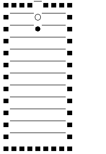

# What is this?
This is a game similar to 'Puyo Puyo' written in Javascript that runs in a browser.  

# What is puyo puyo?
https://en.wikipedia.org/wiki/Puyo_Puyo

# About code
This code was salvaged from old PC.  
This code is quite old and difficult to read.  

# How to play
Key bindings  
[arrow left] - move left  
[arrow right] - move right  
[arrow down] - rotate right  
[F5] - restart

# Code Golf
Tried code golf on this code.  
https://github.com/y-hatano-github/js-puyo-cg
